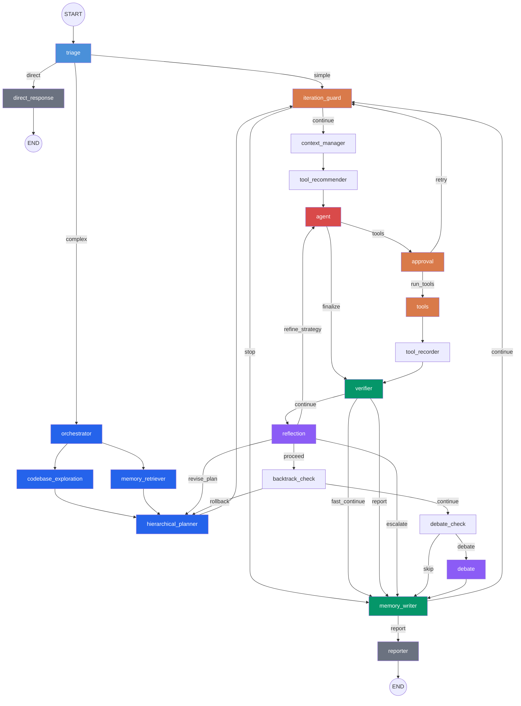
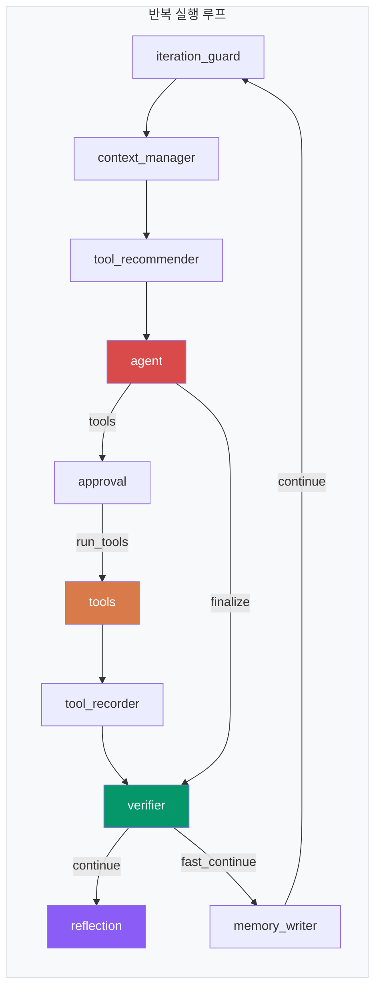
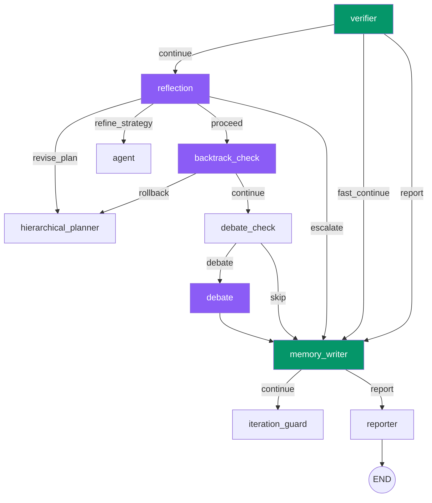
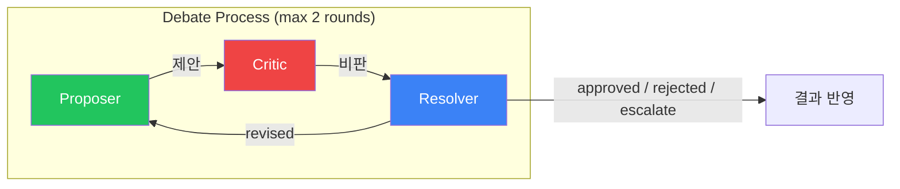
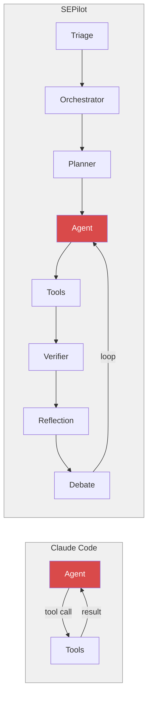

# SEPilot Graph Architecture

SEPilot은 LangGraph 기반의 멀티-에이전트 코딩 시스템입니다. 이 문서는 그래프를 구성하는 20개의 노드와 라우팅 로직을 설명합니다.

## 전체 그래프 흐름

## 핵심 실행 루프 상세

## 검증-반영 체인 상세

## 노드 목록

### 진입 노드

| 노드 | 파일 | 설명 |
|------|------|------|
| **triage** | `base_agent.py` | 사용자 요청을 `direct` / `simple` / `complex` 3가지 경로로 분류 |

### 사전 실행 노드 (Complex 경로 전용)

| 노드 | 파일 | 설명 |
|------|------|------|
| **orchestrator** | `pattern_nodes.py` | 작업을 분석하고 실행 패턴을 선택 |
| **codebase_exploration** | `pattern_nodes.py` | 코드베이스 탐색 및 관련 파일 감지 |
| **memory_retriever** | `pattern_nodes.py` | 이전 작업 경험을 회상 |
| **hierarchical_planner** | `pattern_nodes.py` | 복잡한 작업을 다단계 서브태스크로 분해 |

> `codebase_exploration`과 `memory_retriever`는 `orchestrator` 이후 **병렬 실행(fan-out)** 됩니다.

### 핵심 실행 루프

| 노드 | 파일 | 설명 |
|------|------|------|
| **iteration_guard** | `base_agent.py` | 반복 횟수 제한 확인 → `continue` / `stop` |
| **context_manager** | `base_agent.py` | 토큰 사용량 최적화를 위한 컨텍스트 윈도우 관리 |
| **tool_recommender** | `pattern_nodes.py` | 현재 상황에 적합한 도구 추천 |
| **agent** | `base_agent.py` | LLM 메인 추론 → `tools` / `finalize` |
| **approval** | `base_agent.py` | 민감한 도구 실행 전 사용자 승인 → `run_tools` / `retry` |
| **tools** | `tool_executor.py` | 실제 도구 실행 (52개 이상) |
| **tool_recorder** | `pattern_nodes.py` | 도구 호출 패턴 기록 |

### 검증 및 반영 노드

| 노드 | 파일 | 설명 |
|------|------|------|
| **verifier** | `base_agent.py` | 결과 검증, 작업 완료도 확인 → `continue` / `fast_continue` / `report` |
| **reflection** | `reflection_node.py` | 자기비판, 실패 패턴 감지 → `revise_plan` / `refine_strategy` / `proceed` / `escalate` |
| **backtrack_check** | `pattern_nodes.py` | 상태 롤백 여부 판단 → `rollback` / `continue` |
| **debate_check** | `pattern_nodes.py` | 다중 관점 분석 필요 여부 → `debate` / `skip` |
| **debate** | `debate_node.py` | Proposer-Critic-Resolver 3역할 토론 (최대 2라운드) |

### 출구 노드

| 노드 | 파일 | 설명 |
|------|------|------|
| **memory_writer** | `pattern_nodes.py` | 작업 경험 저장 → `continue` / `report` |
| **reporter** | `base_agent.py` | 최종 결과 정리 보고 → `END` |
| **direct_response** | `base_agent.py` | 간단한 질문에 도구 없이 직접 응답 → `END` |

## Reflection 노드 감지 패턴

| 패턴 | 설명 |
|------|------|
| `stuck_on_single_tool` | 같은 도구를 반복 사용 |
| `repeating_error` | 동일 에러 반복 발생 |
| `no_file_changes` | 예상된 파일 수정이 미실행 |
| `plan_execution_gap` | 계획은 있지만 실행하지 않음 |
| `tool_failure_cascade` | 연속적인 도구 실패 |
| `circular_reasoning` | 순환적 추론 반복 |
| `wrong_file_target` | 잘못된 파일을 편집 |
| `read_without_write` | 읽기만 반복 |
| `shallow_search` | 검색 후 읽지 않고 편집 |
| `overconfident_completion` | 불확실한 완료 주장 |

## Debate 노드 구조

| 역할 | 설명 |
|------|------|
| **Proposer** | 해결책 제안, 이점과 위험 분석 |
| **Critic** | 약점, 보안, 성능 이슈 비판적 분석 |
| **Resolver** | 종합 판단 → `approve` / `reject` / `revise` / `escalate` |

## Claude Code와의 아키텍처 비교

| 특성 | Claude Code | SEPilot |
|------|------------|---------|
| **그래프 구조** | 단순 ReAct 루프 (`agent → tools → agent`) | 20노드 멀티스테이지 그래프 |
| **작업 분류** | 없음 (모든 요청을 동일 처리) | Triage 노드가 `direct`/`simple`/`complex` 3단계 분류 |
| **계획 수립** | LLM이 암묵적으로 계획 | HierarchicalPlanner가 명시적 다단계 계획 수립 |
| **코드베이스 탐색** | LLM이 도구를 직접 선택하여 탐색 | 전용 CodebaseExplorer가 사전 탐색 후 컨텍스트 주입 |
| **도구 실행** | 즉시 실행 (허용 모드 기반) | Approval 노드가 민감 도구 실행 전 승인 관리 |
| **검증** | 없음 (LLM이 스스로 판단) | Verifier 노드가 결과를 별도 검증 |
| **자기 반성** | 없음 | Reflection 노드가 10가지 실패 패턴 감지 및 전략 조정 |
| **백트래킹** | 없음 (실패 시 새로운 시도) | BacktrackingManager가 상태 롤백 지원 |
| **다중 관점** | 없음 | Debate 노드가 Proposer-Critic-Resolver 3역할 토론 |
| **경험 학습** | auto memory (파일 기반) | MemoryBank가 작업 경험을 벡터 저장 및 회상 |
| **도구 추천** | 없음 (LLM이 직접 선택) | ToolLearningSystem이 패턴 학습 후 도구 추천 |
| **컨텍스트 관리** | 자동 압축 (시스템 레벨) | ContextManager가 토큰 최적화를 능동적으로 관리 |
| **반복 제어** | 없음 (무한 루프 가능) | IterationGuard가 최대 반복 횟수 제한 |

### 핵심 차이 요약

**Claude Code**는 `agent ↔ tools`의 **단순 ReAct 루프**로, LLM의 추론 능력에 전적으로 의존합니다. 구조가 단순한 만큼 빠르고 유연하지만, 복잡한 작업에서 삽질하거나 같은 실수를 반복할 수 있습니다.

**SEPilot**은 이를 보완하기 위해 **구조적 안전장치**를 추가합니다:
- **사전 분석**: 작업 난이도를 분류하고, 코드베이스를 미리 탐색하고, 계획을 세운 뒤 실행
- **사후 검증**: 매 반복마다 결과를 검증하고, 실패 패턴을 감지하고, 필요시 계획을 수정하거나 상태를 롤백
- **집단 지성**: 중요한 결정에 대해 Proposer-Critic-Resolver 토론을 통해 다각도 검토

단, 이 구조적 장치들은 추가 LLM 호출 비용과 지연 시간을 수반합니다.

## 주요 파일 경로

| 파일 | 역할 |
|------|------|
| `sepilot/agent/base_agent.py` | 메인 ReactAgent 및 그래프 구축 |
| `sepilot/agent/enhanced_state.py` | 그래프 상태(EnhancedAgentState) 정의 |
| `sepilot/agent/pattern_nodes.py` | 패턴 노드 팩토리 함수 |
| `sepilot/agent/reflection_node.py` | Reflection 노드 구현 |
| `sepilot/agent/debate_node.py` | Debate 노드 구현 |
| `sepilot/agent/memory_bank.py` | 경험 저장소 |
| `sepilot/agent/backtracking.py` | 상태 롤백 관리 |
| `sepilot/agent/tool_learning.py` | 도구 사용 패턴 학습 |
| `sepilot/agent/hierarchical_planner.py` | 다단계 작업 분해 |
| `sepilot/agent/pattern_orchestrator.py` | 패턴 자동 선택 |
| `sepilot/agent/tool_executor.py` | 도구 실행 엔진 |
